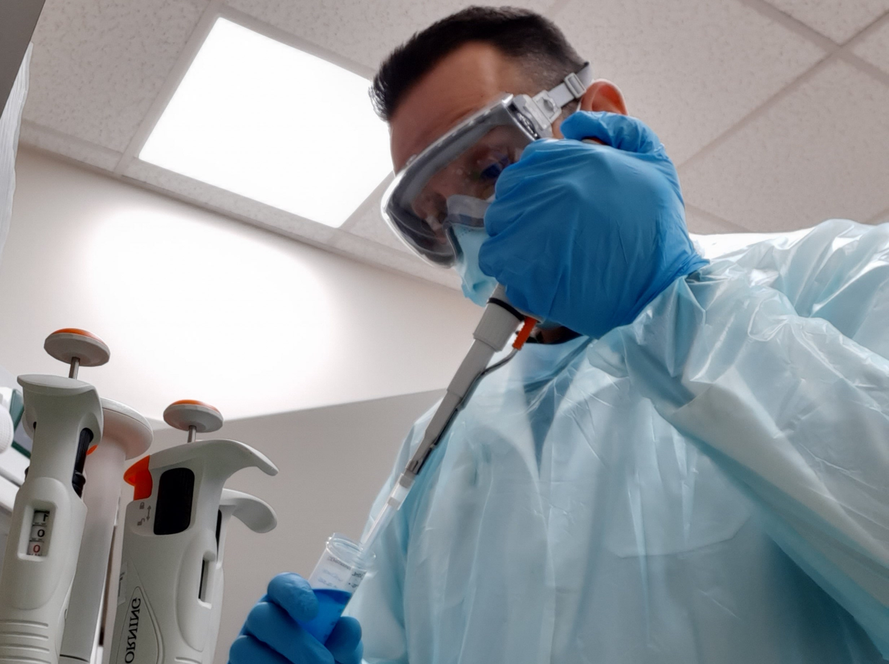

```{r setup, include=FALSE}
knitr::opts_chunk$set(echo = FALSE)
library(slickR)
```

<!--- Aquí comienza el carrusel de fotos --->
<div class="l-screen" style="align-content: center; height: 500px">
```{r}
(
  slickR(obj = c("images/slider/cadi.jpg",
                 "images/slider/puq.jpg"), 
         padding = 1.1,
         width = "85%",
         height = '500px') + 
    settings(autoplay = TRUE, arrows = FALSE, dots = TRUE)
) %synch%
  (
    slickR(obj = c("Centro Asistencial Docente y de Investigación (CADI)", 
                   "Región de Magallanes y Antártica Chilena"), 
           slideType = "p") +
      settings(arrows = FALSE)
  )
```
</div>

<br>
<br>

<!--- Comienza sección l-page --->
<div class="l-page">

<!--- Líneas de investigación --->
<h1>Conoce nuestras líneas de investigación</h1>
<p>Actualmente contamos con tres areas de interés principales.</p>

<!--- Primer tema (#1) --->
<h2>Adaptación humana a ambientes extremos</h2>
<div class="row">
<!--- Columna izquierda (#1) --->
  <div class="two-column">
  
  </div>
<!--- Columna derecha (#1) --->
  <div class="two-column">
  <p style="text-align: justify;">El ser humano ha mostrado ser capaz de adaptarse las condiciones adversas que el medio le impone, sin embargo, existen ciertos escenarios en los cuales aún no es del todo claro cómo el cuerpo se adapta, como por ejemplo el clima polar antártico, en donde la resiliencia es un fenómeno de estudio enfocado a entender los procesos fisiológicos que ocurren en el organismo en ambientes extremos.</p>
  <h3>Convenios y/o colaboradores</h3>
  - MEDIANTAR, Universidad de Minas Gerais, Brasil  
  - Proyecto Habitat, Universidad Arturo Prat, Chile
  </div>
</div>


<!--- Segundo tema (#2) --->
<h2>Neurofisiología del envejecimiento</h2>
<div class="row">
<!--- Columna izquierda (#2) --->
  <div class="two-column">
  
  </div>
<!--- Columna derecha (#2) --->
  <div class="two-column">
  <p style="text-align: justify;">El envejecimiento es un proceso fisiológico que forma parte del ciclo vital de todo ser humano pero el ritmo en el cual este se produce es variable y está en función de factores genéticos, medioambientales y comportamentales.</p>
  <h3>Convenios y/o colaboradores</h3>
  - Centro Interuniversitario de Envejecimiento Saludable (CIES), Chile
  </div>
</div>

<!--- Tercer tema  (#3) --->
<h2>Efectos autonómicos del ejercicio y la actividad física</h2>
<div class="row">
<!--- Columna izquierda (#3) --->
  <div class="two-column">
  
  </div>
<!--- Columna derecha (#3) --->
  <div class="two-column">
  <p style="text-align: justify;"> El sistema nervioso autónomo (SNA) es la parte del sistema nervioso; este regula aquellos procesos fisiológicos de carácter involuntarios, pero tambien pone al organismo en un estado de alerta, generado por diversos agentes estresores. En los últimos años, la literatura sugiere que pueden existir estados desregulados del SNA en diversas condiciones fisiopatológicas, pero que el ejercicio y la actividad física tienen la capacidad para modificar esta respuesta autonómica.</p>
  <h3>Convenios y/o colaboradores</h3>
  - Physical Activity and Exercise Physiology Group, Chile
  </div>
</div>

<!--- Termina sección l-page --->
</div>

<!--- Comienza otra sección l-page --->
<div class="l-page">
<h1>Descubre más</h1>
<p style="text-align: justify;">Junto a nuestro equipo, hemos realizado múltiples estudios de naturaleza científica, orientados a  responder las preguntas relacionadas con nuestras líneas de investigación. A continuación puedes ver nuestros trabajos publicados o al equipo detras de ellos seleccionando uno de los recuadros de abajo.</p>
</div>

<div style="margin: auto;">
<a href="publicaciones.html"><button class="button"><span>Publicaciones </span></button></a>
<a href="nosotros.html"><button class="button"><span>Equipo </span></button></a>
</div>