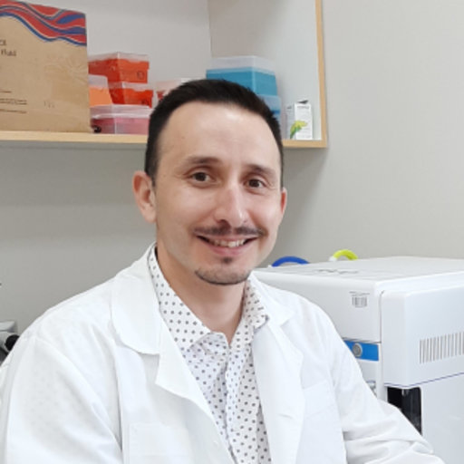

<!--- Primer sujeto --->
<h2>Cristian Núñez Espinosa</h2>

 <!--- Imagen --->
 

 
 

 <!--- Currículo --->
 

 <!--- Situación profesional --->
 <h3>Situación profesional</h3>
 
Profesor asociado en el departamento de Fisiología, en la Escuela de Medicina en la Universidad de Magallaes.

 <!--- Formación académica --->
 <h3>Formación académica</h3>
 
Licenciado en Educación Física, Deporte y Recreación de la Universidad Metropolitana de Ciencias de la Educación en el año 2001.

 
Profesor de Educación Física, Deporte y Recreación de la Universidad Metropolitana de Ciencias de la Educación en el año 2002.

 
Magíster en Educación con Mención en Gestión Educacional de la Universidad de Santiago de Chile en el año 2005.

 
Máster en Fisiología Integrativa de la Universidad de Barcelona de España en el año 2012.

 
Doctor en Fisiología de la Universidad de Barcelona de España en el año 2015.

 <!--- Experiencia profesional --->
 <h3>Experiencia profesional</h3>
 
Docente universitario en Fisiología I y II en la Escuela de Medicina en la Universidad de Magallanes desde el 2015 a la actualidad.

 
Investigador en su Doctorado de Fisiología en la Facultad de Biología de la Universidad de Barcelona en el Departamento de Fisiología e Inmunología de España del año 2012 al 2015.

 
Investigador en su Doctorado de Fisiología en la Facultad de Biología de la Universidad de Barcelona en el Departamento de Fisiología e Inmunología de España del año 2012 al 2015.

 

 

<h2>Matías Castillo Aguilar</h2>

 

 
 

 

 
Acá irá info sobre el currículum

 

 

<h2>Caren Alvarado Aravena</h2>

 

 
 

 

 
Acá irá info sobre el currículum

 

 

<h2>Felipe Retamal Matus</h2>

 

 
 

 

 
Acá irá info sobre el currículum

 

 

<h2>Eduardo Borguenson Barrientos</h2>

 

 
 

 

 
Acá irá info sobre el currículum

 

 

<h2>Matías Riquelme Ortega</h2>

 

 
 

 

 
Acá irá info sobre el currículum

 

 

<h2>Camila Vasquez Cancino</h2>

 

 
 

 

 
Acá irá info sobre el currículum

 

